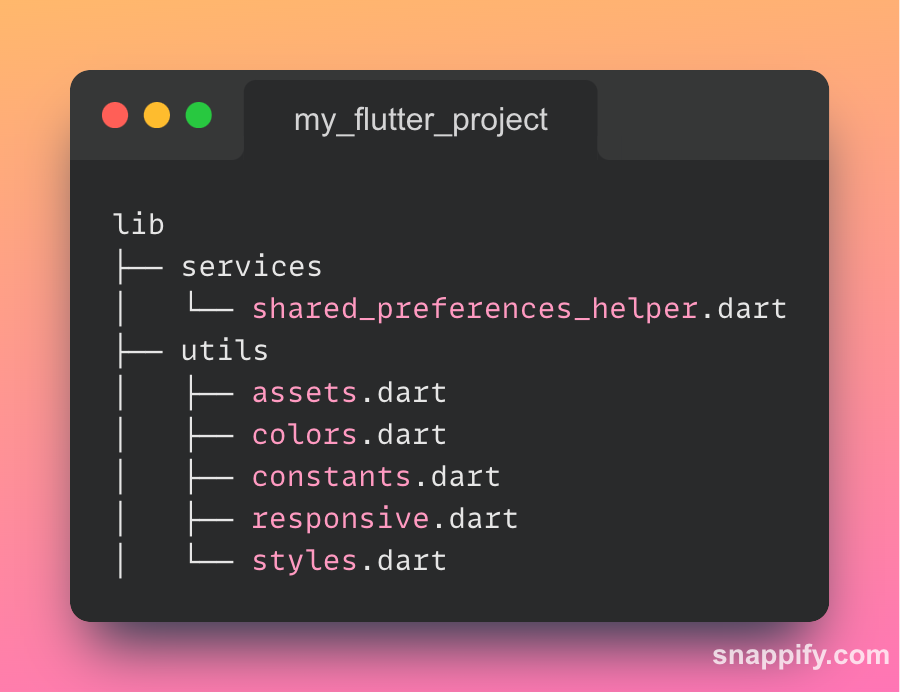

  

# Startify - Your Swiss Army Knife for Flutter Projects

## Table of Contents

- [Startify - Your Swiss Army Knife for Flutter Projects](#startify---your-swiss-army-knife-for-flutter-projects)
  - [Introduction](#introduction)
  - [Generated folder structure:](#generated-folder-structure)
  - [Getting Started](#getting-started)
  - [Contributing](#contributing)
  - [License](#license)

## Introduction

Welcome to Startify, your all-in-one companion for creating awesome Flutter projects with ease! Whether you're starting a new project or need to jump-start development on your next brilliant idea, Startify has got your back. Say goodbye to tedious repetitive setup tasks and hello to a smooth, delightful development experience.

Startify isn't just another mundane extension. It's a Swiss Army Knife for Flutter projects! We've assembled a collection of useful tools and utilities inside the `utils` and `services` folder, so you can focus on building incredible apps rather than wasting time on boilerplate code.

## Generated folder structure:

  

- **Shared Preferences Helper:**
  - *File:* `lib/utils/services/shared_preferences_helper.dart`
  - *Description:* Utility class for handling shared preferences with most commonly used shared preferences methods.

- **Assets Utility:**
  - *File:* `lib/utils/assets.dart`
  - *Description:* Utility class for defining asset paths like images, svgs, gifs, etc.

- **Colors Utility:**
  - *File:* `lib/utils/colors.dart`
  - *Description:* Utility class for defining colors to be used throughout the app.

- **Constants Utility:**
  - *File:* `lib/utils/constants.dart`
  - *Description:* Utility class with constantly used variables/extensions/utility methods (includes some prethrown good stuff 😉).

- **Responsive Widget:**
  - *File:* `lib/utils/responsive.dart`
  - *Description:* A responsive widget for handling different screen sizes.

- **Styles Utility:**
  - *File:* `lib/utils/styles.dart`
  - *Description:* Utility class for defining text styles and input decorations.

## Getting Started

Startify is easy to install and use. Here's how you can get started:

1. Install the Extension:
   - Open Visual Studio Code.
   - Go to the Extensions view (`Ctrl+Shift+X` or `Cmd+Shift+X` on Mac).
   - Search for "Startify" and click "Install."

2. Run the Command:
   - Open your Flutter project in Visual Studio Code.
   - Make sure that the lib folder has been generated (crucial step)
   - Press `F1` (or `Ctrl+Shift+P` / `Cmd+Shift+P` on Mac) to open the Command Palette.
   - Type "Startify: Generate Startify" and select the command when it appears in the list.

That's it! The extension will work its magic, generating the necessary files and folders inside the `lib` folder of your Flutter project with the corresponding boilerplate code.

## Contributing

We welcome all contributions to make Startify even more fantastic! If you have an idea for a new feature or find a bug, head over to our [GitHub repository](https://github.com/CodeSadhu/startify) and let us know. We encourage you to be creative, innovative, and humorous in your contributions (just like this README!).

## License

Startify is released under the [MIT License](https://opensource.org/licenses/MIT), which means you can use it freely in your projects without any worries.

---

We hope you find Startify as delightful to use as we found it delightful to build! Happy coding, and remember, "Boilerplates don't have to be boring!" 😄🚀
